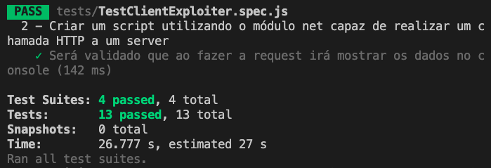

### Termos e acordos

Ao iniciar este projeto, você concorda com as diretrizes do Código de Ética e Conduta e do
Manual da Pessoa Estudante da Trybe.

# Boas vindas ao projeto Explorando os protocolos

Você já usa o GitHub diariamente para desenvolver os exercícios, certo? Agora, para desenvolver os projetos, você deverá seguir as instruções a seguir. Fique atento a cada passo, e se tiver qualquer dúvida, nos envie por Slack! #vqv 🚀

Aqui você vai encontrar os detalhes de como estruturar o desenvolvimento do seu projeto a partir deste repositório, utilizando uma branch específica e um Pull Request para colocar seus códigos.

---

# Sumário

- [Habilidades](#habilidades)
- [Entregáveis](#entregáveis)
  - [O que deverá ser desenvolvido](#o-que-deverá-ser-desenvolvido)
  - [Desenvolvimento](#desenvolvimento)
  - [Data de Entrega](#data-de-entrega)
- [Instruções para entregar seu projeto](#instruções-para-entregar-seu-projeto)
  - [Antes de começar a desenvolver](#antes-de-começar-a-desenvolver)
  - [Durante o desenvolvimento](#durante-o-desenvolvimento)
  - [Como desenvolver](#como-desenvolver)
    - [Linter](#linter)
    - [Testes](#testes)
- [Requisitos do projeto](#requisitos-do-projeto)
    - [1 - Criar um servidor TCP utilizando o módulo net que exiba no console todo o conteúdo recebido](#1---criar-um-servidor-tcp-utilizando-o-módulo-net-que-exiba-no-console-todo-o-conteúdo-recebido)
    - [2 - Criar um script utilizando o módulo net capaz de realizar um chamada HTTP a um server](#2---criar-um-script-utilizando-o-módulo-net-capaz-de-realizar-um-chamada-http-a-um-server)
    - [3 - Criar um server TCP utilizando o módulo net capaz de responder com uma mensagem HTTP](#3---criar-um-server-tcp-utilizando-o-módulo-net-capaz-de-responder-com-uma-mensagem-http)
    - [4 - Criar um túnel através do Ngrok](#4---criar-um-túnel-através-do-ngrok)
    - [5 - Configurar uma chamada HTTPS à API `iplocation`](#5---configurar-uma-chamada-https-à-api-iplocation)
    - [6 - Adicionar a estrutura de início de requisição HTTP](#6---adicionar-a-estrutura-de-início-de-requisição-http)
    - [7 - Adicionar a estrutura de fim da requisição HTTP](#7---adicionar-a-estrutura-de-fim-da-requisição-http)
    - [8 - Identificar o endereço de IP do client](#8---identificar-o-endereço-de-ip-do-client)
    - [9 - Configurar a request HTTPS para enviar o endereço IP](#9---configurar-a-request-https-para-enviar-o-endereço-ip)
    - [10 - Responder o IP do client](#10---responder-o-ip-do-client)
    - [11 - Responder informações extraídas através do IP do client](#11---responder-informações-extraídas-através-do-ip-do-client)
    - [12 - Responder dados do dispositivo (client)](#12---responder-dados-do-dispositivo-client)
    - [13 - Responder a request com os resources do Server](#13---responder-a-request-com-os-resources-do-server)
- [Depois de terminar o desenvolvimento](#depois-de-terminar-o-desenvolvimento)
- [Revisando um pull request](#revisando-um-pull-request)
- [Avisos Finais](#avisos-finais)

# Habilidades

Neste projeto, verificamos se voce é capaz de:

- Conforme aprendemos nas últimas aulas, conhecer a base do funcionamento dos computadores e das redes e suas arquiteturas nos permite utilizá-los melhor e de maneira mais eficiente, entendendo de fato o porquê de fazer algo de uma maneira ou de outra que envolva esses conceitos.

- Diariamente estamos lidando com diversas máquinas e seus recursos, assim como as diversas redes.

- Afinal, em nossa jornada até aqui, desenvolvemos diversos aplicativos feitos para rodar na WEB, que utilizam os diversos protocolos e outros conceitos, assim como utilizam o SO e a arquitetura dos computadores.

- Além disso, teremos conhecimento para desenvolver soluções melhores, assim como lidar com ambientes/servidores publicados na internet, conhecendo alguns dos perigos de ter uma aplicação exposta a internet e sabendo como agregar segurança a ela.

# Entregáveis

Para entregar o seu projeto você deverá criar um Pull Request neste repositório.

Lembre-se que você pode consultar nosso conteúdo sobre
[Git & GitHub](https://course.betrybe.com/intro/git/) sempre que precisar!

---

## O que deverá ser desenvolvido

Você irá refatorar parte de um servidor HTTP, porém, esse servidor não está utilizando o módulo HTTP e sim o módulo `net`, ou seja, só temos a camada de transporte implementada (TCP).

O objetivo da refatoração é implementar algumas partes da camada de apresentação HTTP sem utilizar bibliotecas ou módulos para isso.

Durante o projeto, iremos passar por todas as camadas da pilha de protocolos `TCP/IP`. Neste projeto, você **expandirá** o seu conhecimento de protocolos, explorando e aprendendo como lidar com as operações de rede!

O _servidor_ deverá responder uma página HTML através do HTTP, mostrando algumas informações sobre o _client_, como dados sobre a localização, o dispositivo e a empresa provedora de internet.

Mas não se preocupe, pois por ser um conteúdo novo e representar um desafio um pouco diferente, em cada requisito haverão explicações sobre o que está acontecendo, além do que deve ser feito, para que haja ligação entre o código e a arquitetura de redes em si.

---

## Desenvolvimento

O servidor TCP responde com uma página HTML, porém, deverá ser adicionado a ele as informações de _control_ do protocolo HTTP que representam o início e o final da _response_.

Você terá que utilizar o módulo `net` para descobrir como é uma requisição e uma resposta HTTP de maneira "crua", ou seja, sem estar encapsulada pelo protocolo.

O código também realiza uma consulta à API pública [iplocation](https://iplocation.com/) onde, através de uma chamada HTTPS, passando um endereço de IP externo, é possível extrair algumas informações sobre o _client_.

Utilizaremos o _ngrok_ para criar um túnel para o nosso projeto, tornando possível acessá-lo através da internet e não somente local. Dessa forma conseguiremos acessá-lo de outros dispositivos e conseguiremos ter acesso ao endereço de IP externo do _client_ que fizer a requisição através da _request_ e, então, utilizaremos esse IP para extrair as informações pela API _iplocation_.

Por último, alguns requisitos são dependentes uns dos outros, então recomendamos que desenvolva o projeto fazendo os requisitos na ordem em que eles forem apresentados, isso vai **ajudar muito** no entendimento do que está sendo proposto.

**E atenção!** Esse trabalho usa bastante o que vocês aprenderam nos exercícios da aula de [arquitetura de redes](https://app.betrybe.com/course/computer-science/network-architecture#exercicios). Usem-nos de referência, assim como a [documentação do módulo NET do Node.js](https://nodejs.org/api/net.html#net_net_createserver_options_connectionlistener). E contem com nossa ajuda também no Slack! 👊 

> **Dica**: Se estiver com dificuldades para avançar no projeto, dê uma olhada [nesse artigo](https://www.mattzeunert.com/2018/10/25/manually-making-an-http-request-with-nodejs.html), pois ele faz algo bem parecido com o que estamos pedindo! 😉

### Data de Entrega

  - Serão `1` dias de projeto.
  - Data de entrega para avaliação final do projeto: `30/07/2021 - 14:00h`.

---

## Instruções para entregar seu projeto:

### ANTES DE COMEÇAR A DESENVOLVER:

1. Clone o repositório

- `git clone https://github.com/tryber/sd-07-project-exploring-the-protocols.git`.
- Entre na pasta do repositório que você acabou de clonar:
  - `cd sd-07-project-exploring-the-protocols`

2. Instale as dependências

- `npm install`

Atenção :warning: Não rode o comando npm audit fix! Ele atualiza várias dependências do projeto, e essa atualização gera conflitos com o avaliador.

3. Crie uma branch a partir da branch `master`

- Verifique que você está na branch `master`
  - Exemplo: `git branch`
- Se não estiver, mude para a branch `master`
  - Exemplo: `git checkout master`
- Agora crie uma branch à qual você vai submeter os `commits` do seu projeto
  - Você deve criar uma branch no seguinte formato: `nome-de-usuario-nome-do-projeto`
  - Exemplo: `git checkout -b joaozinho-project-exploring-the-protocols`

4. Adicione as mudanças ao _stage_ do Git e faça um `commit`

- Verifique que as mudanças ainda não estão no _stage_
  - Exemplo: `git status` (deve aparecer listado o arquivo _index.js_ em vermelho)
- Adicione o arquivo alterado ao _stage_ do Git
  - Exemplo:
    - `git add .` (adicionando todas as mudanças - _que estavam em vermelho_ - ao stage do Git)
    - `git status` (deve aparecer listado o arquivo _index.js_ em verde)
- Faça o `commit` inicial
  - Exemplo:
    - `git commit -m 'iniciando o projeto Explorando os Protocolos'` (fazendo o primeiro commit)
    - `git status` (deve aparecer uma mensagem tipo _nothing to commit_ )

5. Adicione a sua branch com o novo `commit` ao repositório remoto

- Usando o exemplo anterior: `git push -u origin joaozinho-project-exploring-the-protocols`

6. Crie um novo `Pull Request` _(PR)_

- Vá até a página de _Pull Requests_ do repositório no GitHub
- Clique no botão verde _"New pull request"_
- Clique na caixa de seleção _"Compare"_ e escolha a sua branch **com atenção**
- Clique no botão verde _"Create pull request"_
- Adicione uma descrição para o _Pull Request_ e clique no botão verde _"Create pull request"_
- **Não se preocupe em preencher mais nada por enquanto!**
- Volte até a página de _Pull Requests_ do repositório e confira que o seu _Pull Request_ está criado

---

### Durante o desenvolvimento

* ⚠ **PULL REQUESTS COM ISSUES NO LINTER NÃO SERÃO AVALIADAS, ATENTE-SE PARA RESOLVÊ-LAS ANTES DE FINALIZAR O DESENVOLVIMENTO!** ⚠

* Faça `commits` das alterações que você fizer no código regularmente

* Lembre-se de sempre após um (ou alguns) `commits` atualizar o repositório remoto

* Os comandos que você utilizará com mais frequência são:
  1. `git status` _(para verificar o que está em vermelho - fora do stage - e o que está em verde - no stage)_
  2. `git add` _(para adicionar arquivos ao stage do Git)_
  3. `git commit` _(para criar um commit com os arquivos que estão no stage do Git)_
  5. `git push -u nome-da-branch` _(para enviar o commit para o repositório remoto na primeira vez que fizer o `push` de uma nova branch)_
  4. `git push` _(para enviar o commit para o repositório remoto após o passo anterior)_

---

## Linter

Para garantir a qualidade do código, vamos utilizar neste projeto o linter `ESLint`.
Assim o código estará alinhado com as boas práticas de desenvolvimento, sendo mais legível
e de fácil manutenção! Para rodá-lo localmente no projeto, execute o comandos abaixo:

  ```bash
npm run lint
```

⚠️ **PULL REQUESTS COM ISSUES DE LINTER NÃO SERÃO AVALIADAS.
ATENTE-SE PARA RESOLVÊ-LAS ANTES DE FINALIZAR O DESENVOLVIMENTO!** ⚠️

---

## Testes

## Executar os testes

Para executar os testes basta executar o comando `npm run test` que irá apresentar esse resultado abaixo:


## Dica: desativando testes

Especialmente no início, quando a maioria dos testes está falhando, a saída após executar os testes é bastante poluída. Você pode desabilitar temporariamente um teste utilizando a função `skip` junto à função `it`. Como o nome indica, esta função "pula" um teste:

```js
it.skip('it includes the text `Movie Cards Library` inside a h1 tag', () => {
  wrapper = shallow(<Header />);

  expect(wrapper.find('header h1').text()).toBe('Movie Cards Library');
});
```

## Requisitos do projeto

### 1 - Criar um servidor TCP utilizando o módulo net que exiba no console todo o conteúdo recebido

Faça um _script_ (`exploiters/serverExploiter.js`) para criar um servidor TCP que mostre no console todo o conteúdo recebido. Depois, podemos acessá-lo pelo navegador e descobrir como é o `data` de uma requisição HTTP.

### Observação técnica 

> **Dica 1**: Responda para o navegador da maneira correta usando o `socket.write`, passando o `RESPONSE` como parâmetro, só queremos descobrir a estrutura da _request_. Não esqueca de fechar essa requisição com o `socket.end`.

> Além disso, volte ao [conteúdo de Arquitetura de redes](https://app.betrybe.com/course/computer-science/network-architecture) para retomar alguns conceitos importantes! Além do conteúdo escrito você também pode consultar o [gabarito dos exercícios](https://app.betrybe.com/course/computer-science/network-architecture/solutions).

> **Dica 2**: Logo após terminar de fazer o servidor corretamente, coloque-o online e tente acessá-lo como se fosse um site. 

> Você vai ver um texto no navegador, mas isso não é importante, pois o importante você receberá na **console do node**. Você utilizará essa resposta no próximo requisito.

> **Dica 3**: Lembre-se de que o servidor aqui, tem sintaxe muito parecida com o **socket.io**, então métodos como `createServer`, `on` e `write` podem ajudar a resolver o desafio.

> **Dica 4**: Não se esqueça do socket.end(); para fechar o socket. Sem ele sua requisição ficará em loop infinito e será impossível testar. (CAUTION: request is not finished yet!)

### Além disso, as seguintes verificações serão feitas:

**[Será validado que ao fazer a request e acessar o chrome irá mostrar os dados no console]**

### 2 - Criar um script utilizando o módulo net capaz de realizar um chamada HTTP a um server

Crie um novo script (`exploiters/clientExploiter.js`), que utilize a _request_ extraída no [requisito anterior (1)](#-1---Criar-um-servidor-TCP-utilizando-o-módulo-net-que-exiba-no-console-todo-o-conteúdo-recebido), realizando as devidas modificações para fazer uma request HTTP à página do Google (`google.com`) e, então, exiba no console a resposta "crua" dada pelo servidor da Google. **Ou seja, crie uma requisição HTTP “na mão” usando como base a resposta de saída da requisição do requisito 1. Você irá copiar o response do requisito anterior para montar sua requisição neste requisito. Você pode utilizar, pra fazer essa requisição "na mão", o `client.write` do NET**

Aqui descobrimos como é uma response HTTP sem encapsulá-la.

### Observação técnica 

> **Dica 1**: Na request (que é a saída do console do node do primeiro requisito) existem características que indicam ao HTTP onde a request finaliza, então, tenha certeza que pegou todo o conteúdo, inclusive quebras de linhas. Para representar as quebras de linhas você pode utilizar "template strings".

> **Dica 2**: Ao pegar a request, gaste algum tempo lendo a mesma e perceberá que uma das propriedades da request, a **Host** tem o endereço que você tentou acessar antes.

> **Dica 3**: Lembre-se de que o cliente aqui, tem sintaxe muito parecida com o **socket.io**, então métodos como `connect`, `on` e `write` podem ajudar a resolver o desafio.

### Além disso, as seguintes verificações serão feitas:

**[Será validado que ao fazer a request irá mostrar os dados no console]**

### 3 - Criar um server TCP utilizando o módulo net capaz de responder com uma mensagem HTTP

Utilizando a _response_ capturada no [requisito anterior (2)](#-2---Criar-um-script-utilizando-o-módulo-net-capaz-de-realizar-um-chamada-HTTP-a-um-server), faça um _server_ (`exploiters/httpServer.js`) que responda uma página HTML, faça as devidas modificações na response para que retorne uma mensagem com o **status code HTTP 200**.

### Observação técnica 

> **Dica 1**: Você pode começar fazendo um servidor, será muito parecido sintaticamente com o que fizemos no requisito 1, porém agora vamos ter que passar uma requisição que esteja corretamente montada para o método `write`.

> **Dica 2**: Você precisa de um retorno código 200 para que tudo funcione bem, você pode conseguir um modelo de response para utilizar aqui de diversas maneiras, como por exemplo lendo o material que passamos mais acima no [artigo](https://www.mattzeunert.com/2018/10/25/manually-making-an-http-request-with-nodejs.html). 
> A grande diferença desse requisito para o requisito 1, é que ao acessar esse servidor via navegador, ele retorne o **HTML** que você colocar para ser retornado.

> **Dica 3**: Lembre-se de que o servidor aqui, tem sintaxe muito parecida com o **socket.io**, então métodos como `createServer`, `on` e `write` podem ajudar a resolver o desafio.

### Além disso, as seguintes verificações serão feitas:

**[Será validado que ao fazer a request e acessar a url irá mostrar o texto "Protocolos"]**

### 4 - Criar um túnel através do Ngrok.

O 'ngrok' é nada mais nada menos do que um "túnel", onde a função dele é redirecionar conexões externas para o seu localhost. Ou seja, você consegue com ele, por exemplo, rodar um projeto que está em 'localhost' na rede externa e mostrar para outras pessoas.

Dessa forma, crie um túnel para seu `localhost`, utilizando o `Ngrok`. Em seguida, acesse-o de diferentes dispositivos de rede para testar o funcionamento do nosso projeto.

Um túnel é um redirecionador, ele pode redirecionar IPs e portas para outros IPs e portas, no nosso caso, iremos utilizar a partir de agora o endereço que o `ngrok` nos fornecer para acessar o nosso servidor `net`. 

Outro ponto importante é estar sempre atento a porta que estamos expondo do nosso `localhost` para a rede externa via túnel, que deve ser sempre igual a porta utilizada no servidor `net`.

Adicione no arquivo `instructions.json` o passo-a-passo com os comandos `ngrok` e `Node.js` para executar e realizar a publicação do projeto.

Adicione no arquivo `instructions.json` na chave token o seu token **atráves dele que o avaliador irá usar o ngrok**.

### Observação técnica 

> **Dica 1**: Consulte o `getting started - setup`na [página](https://dashboard.ngrok.com/get-started/setup) para instalar o `ngrok` corretamente.

> **Dica 2**: Lembre-se que a porta com que devemos rodar o `ngrok` deve ser a porta que o servidor que queremos acessar está rodando! Então sempre verifique a porta que está utilizando no momento.

> **Dica 3**: Existe uma versão do ngrok específica do seu sistema operacional, adicione na pasta raiz do projeto.

> **Dica 4**: O ngrok só pode abrir um tunel por conta, então tome alguns cuidados:

- Primeiro verifique que não tem nenhum tunel aberto na sua maquina.

- Faça um push por vez e espere terminar de rodar para fazer outro push.

- Verifique que você está subindo o `ngrok` da versão linux para o github pois ele é a versão correta para o avaliador funcionar.

### Além disso, as seguintes verificações serão feitas:

**[Será validado se os comandos estão dentro do arquivo instruction.json]**

### 5 - Configurar uma chamada HTTPS à API `iplocation`

No projeto temos o arquivo `location.js`, responsável por fazer a _request_ HTTPS à API `iplocation`. Altere o objeto `options` desse arquivo para a seguinte configuração:

- hostname: "iplocation.com";

- port: Preencha com a porta padrão HTTPS;

- path: '/';

- method: POST;

- headers: Adicione o header "Content-Type", com o valor "application/x-www-form-urlencoded".

### Observação técnica 

> **Dica 1**: Aqui vamos escrever as informações necessárias para fazer uma requisição, então é só preencher o objeto corretamente.

> **Dica 2**: Nesse momento, não dá para testar o requisito, pois faltam informações, se prestarmos atenção ao código do `location.js`, veremos que a função `getLocationInfos` recebe um parâmetro que não está sendo utilizado. Os próximos requisitos utilizarão esse parâmetro e aí sim esse requisito aqui poderá ser testado.

> **Dica 3**: Apesar de poder subir várias instâncias do `ngrok`, suba as instâncias conforme for necessitando em cada requisito, pois a cada requisito a porta pode mudar.

> **Dica 4**: Caso esteja recebendo um erro de `connection refused` no navegador, verifique a porta do seu túnel.

### Além disso, as seguintes verificações serão feitas:

**[Será validado que foi configurada a chamada do `iplocation`]**

### 6 - Adicionar a estrutura de início de requisição HTTP

No arquivo `index.js` do projeto, altere a variável `startOfResponse` para receber a estrutura que descobrimos anteriormente, da mesma forma que fizemos no [requisito 3](#-3---Criar-um-server-TCP-utilizando-o-módulo-net-capaz-de-responder-com-uma-mensagem-HTTP). Faça as devidas alterações para que a resposta tenha os seguintes valores:

- Versão 1.1 do protocolo HTTP;

- Status code `HTTP 200`;

- Header "Content-Type" como "text/html; charset=UTF-8".

### Observação técnica 

> **Dica 1**: Antes de começar a trabalhar nesse requisito, leia o código do arquivo `index.js` com atenção, ele vai lhe dar pistas sobre o que você precisará fazer aqui e o contexto do código a ser escrito.

> **Dica 2**: Mais uma vez, não esqueça das quebras de linhas 😉. Não é necessário nenhum outro header além do "Content-Type".

> **Dica 3**: Ainda precisa de mais código para funcionar, continue adiante!

### Além disso, as seguintes verificações serão feitas:

**[Será validado que foi adicionado a estrutura da requisição no startOfResponse]**

### 7 - Adicionar a estrutura de fim da requisição HTTP

Ainda no arquivo `index.js`, altere a variável `endOfResponse` para receber a estrutura utilizada pelo HTTP para informar o fim de uma request.

### Observação técnica 

> **Dica 1**: Ainda precisa de mais código para funcionar, continue adiante!

### Além disso, as seguintes verificações serão feitas:

**[Será validado que foi adicionado a estrutura da requisição no endOfResponse]**

### 8 - Identificar o endereço de IP do client

Utilizando a função `getHeaderValue`, extraia do data o header `X-Forwarded-For`. Esse header será adicionado pelo nosso túnel automaticamente, contendo o endereço de IP do _client_. Passe esse IP para a função `getLocationInfos`, para que possamos extrair dados através dele.

### Observação técnica 

> **Dica 1**: Converta o data para String antes de extrair os headers.

> **Dica 2**: A função `getLocationInfos` recebe como parâmetro a variável `clientIP`, então utilize a função `getHeaderValue` passando as informações e o header que precisamos do valor.

> **Dica 3**: Para poder ver o header que estamos falando no requisito, é necessário criar o túnel com o `ngrok` para que esse header exista na requisição e seu valor possa ser capturado.

> **Dica 4**: Caso tenha dificuldade em entender a função `getHeaderValue`, experimente usar alguns `console.log` nas variáveis internas da função!

> **Dica 5**: Ainda falta um requisito para finalizarmos a requisição e por isso, não conseguiremos testar agora, tenha a certeza de ter colocado a mensagem de texto que foi pedida e passe para o próximo requisito!

### Além disso, as seguintes verificações serão feitas:

**[Será validado que foi adicionado o código para pegar endereço de IP]**

### 9 - Configurar a request HTTPS para enviar o endereço IP

Agora, no arquivo `location`, **antes de finalizar a request**, adicione uma linha que envie o ip do cliente, utilizando o método `write` da requisição. A _API_ espera receber a seguinte mensagem texto: "ip=CLIENT_IP".

### Observação técnica 

> **Dica 1**: A API espera receber um body sem nenhuma formatação. Envie a string conforme exemplo, substituindo o `CLIENT_IP` pela variável recebida no método.

> **Dica 2**: Atente-se para o fato que em nosso código, `responses` são chamadas de `res` e `requests` são chamadas de `req`.

> **Dica 3**: Se tudo foi feito corretamente até aqui, ao ir até o navegador você terá uma surpresa bem positiva! Caso nada apareça, verifique seus headers, podem estar faltando partes importantes deles lá, verifique-os.

### Além disso, as seguintes verificações serão feitas:

**[Será validado que foi adicionado a request no arquivo location]**

### 10 - Responder o IP do client

Adicione mais um comando `write`, na estrutura do response do arquivo `index.js`, para responder com o endereço de IP do _client_ extraído no [requisito 8](#-8---Identificar-o-endereço-de-IP-do-client).

### Observação técnica 

- Adicione uma tag `data-testid="ip"` junto ao texto do client_ip.

### Além disso, as seguintes verificações serão feitas:

**[Será validado que ao acessar a url sera possível visualizar o ip do client]**

### 11 - Responder informações extraídas através do IP do client

Adicione mais comandos `write`, na estrutura do response. A resposta da API `iplocation` deverá conter as seguintes informações:

### Observação técnica 

- Cidade;
   - E adicione a tag `data-testid="city"` para o front.

- Código Postal (da cidade);
   - E adicione a tag `data-testid="postal_code"` para o front.

- Região e nome da região;
   - E adicione a tag `data-testid="region"` para o front.

- Nome do país;
   - E adicione a tag `data-testid="country"` para o front.

- Companhia (nome da provedora de internet);
   - E adicione a tag `data-testid="company"` para o front.

### Além disso, as seguintes verificações serão feitas:

**[Será validado que as informações da localização do cliente serão exibidas na tela]**

## Bônus

### 12 - Responder dados do dispositivo (client)

Utilizando também a função para extrair informações dos _headers_ da _request_, extraia o conteúdo do _header_ `User-Agent` e o adicione na estrutura da response.

### Observação técnica 

> **Dica**: Converta o data para String antes de extrair os headers.

   - E adicione a tag `data-testid="device"` para o front.

### Além disso, as seguintes verificações serão feitas:

**[Será validado se que ao acessar a tela listou os dados do dispositivo]**

### 13 - Responder a request com os resources do Server

Ao identificar a correspondência do [requisito anterior (12)](#-12---Criar-um-endpoint-/server), utilizando os módulos nativos do `node.js` para chamadas ao sistema operacional, responda, ao invés dos dados do _client_, dados do server:

### Observação técnica 

- O Sistema Operacional, sua versão e arquitetura;
   - E adicione a tag `data-testid="arch"` para o front.

- Informações sobre a CPU - quantidade de cores, o modelo e velocidade 
de cada um;
   - E adicione a tag `data-testid="cpu"` para o front.

- Quantidade de memória total em gigabytes (GB).
   - E adicione a tag `data-testid="memory"` para o front.

> **Dica**: Pode adicionar na mesma requisição do `getLocationInfos` do arquivo `index.js`.

---

### Depois de terminar o desenvolvimento

Para **"entregar"** seu projeto, siga os passos a seguir:

* Vá até a página **DO SEU** _Pull Request_, adicione a label de _"code-review"_ e marque seus colegas
  * No menu à direita, clique no _link_ **"Labels"** e escolha a _label_ **code-review**
  * No menu à direita, clique no _link_ **"Assignees"** e escolha **o seu usuário**
  * No menu à direita, clique no _link_ **"Reviewers"** e digite `students`, selecione o time `tryber/students-sd-07`

Se ainda houver alguma dúvida sobre como entregar seu projeto, [aqui tem um video explicativo](https://vimeo.com/362189205).

⚠ Lembre-se que garantir que todas as _issues_ comentadas pelo **Lint** estão resolvidas! ⚠

---

### Revisando um pull request

À medida que você e as outras pessoas que estudam na Trybe forem entregando os projetos, vocês receberão um alerta via Slack para também fazer a revisão dos Pull Requests dos seus colegas. Fiquem atentos às mensagens do "Pull Reminders" no Slack!

Use o material que você já viu sobre [Code Review](https://course.betrybe.com/real-life-engineer/code-review/) para te ajudar a revisar os projetos que chegaram para você.

---

# Avisos Finais

Ao finalizar e submeter o projeto, não se esqueça de avaliar sua experiência preenchendo o formulário. Leva menos de 3 minutos!

Link: [FORMULÁRIO DE AVALIAÇÃO DE PROJETO](https://be-trybe.typeform.com/to/ZTeR4IbH)

O avaliador automático não necessariamente avalia seu projeto na ordem em que os requisitos aparecem no readme. Isso acontece para deixar o processo de avaliação mais rápido. Então, não se assuste se isso acontecer, ok?

---
